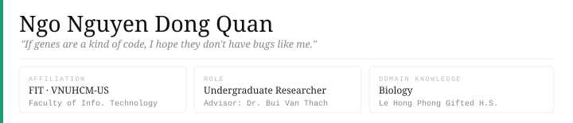

---

## Research
| Project | Area | Status |
|---|---|---|
| Malware classification via pixel-based RGB conversion | Computer Vision · MAPR 2026 | Submitted |
| Multimodal image & video retrieval using text queries | Multimodal AI · AI Challenge 2025 | Completed |
| Literature review automation system | NLP · Biomedical | Active |

---

## Interests
- Molecular biology and genetics, applying artificial intelligence to solve challenges in the biomedical field
- A little bit of mathematics - something I can't understand?
- A deep conversation on a topic I like? If you like yapping, just DM me
- Vietnamese food _If you're not Vietnamese, please come here and try it; I'm sure you won't be able to stop._

---

## Honors & Awards
**Computer Science & AI**
- 🏅 Finalist — AI Challenge Ho Chi Minh City (2024, 2025) _Yes, the prize in this competition is not for me ;>_
- 🥈 2nd Entrance Candidate — VNUHCM Aptitude Test: 1035/1200, Top 0.35% (2024)

**Biology**
- 🥈 2nd Prize — National Biology Olympiad for Undergraduate Students (2025)
- 🥉 3rd Prize — Vietnam Biology Olympiad for High School Students / VBO (2024)

---

## Contact
- 📧 [nndquan296@gmail.com](mailto:nndquan296@gmail.com)
- 💬 [Facebook · Đông Quân](https://www.facebook.com/dongquan.209/)
- 💼 [LinkedIn](https://www.linkedin.com/in/dongquan296/)
- 📄 [Curriculum Vitae](https://drive.google.com/file/d/1JZMmg0R3dU2MoJEnSfGvXewdASrtzjU-/view?usp=sharing)
